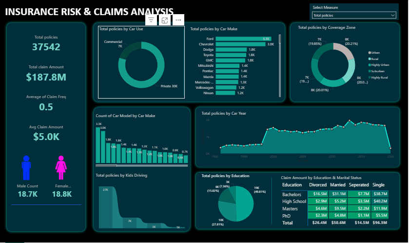

📊 Insurance Risk & Claims Analysis Dashboard (Power BI)

📌 Project Overview

This project presents an end-to-end Insurance Risk & Claims Analysis Dashboard built entirely using Power BI. The objective is to analyze policy and claims data to identify risk exposure, claim trends, and customer segmentation patterns that support data-driven insurance decision-making.

The dashboard transforms raw insurance data into interactive visual insights for underwriting, risk assessment, and performance monitoring.

🎯 Business Problem

Insurance companies must continuously monitor:

Claim frequency and severity

Loss ratio trends

High-risk policy segments

Regional risk exposure

Demographic-based claim patterns

Without proper visualization, identifying risk concentration and profitability trends becomes difficult.

This dashboard addresses these challenges by providing clear KPI tracking and risk segmentation analysis.

📂 Dataset Information

Insurance policy and claims dataset

37,542 total policies analyzed

Key fields included:

Policy ID

Car Make & Model

Car Usage (Commercial / Private)

Claim Amount

Claim Frequency

Education Level

Marital Status

Region

Policy Year

🛠 Tools & Technologies

Power BI

DAX Measures

Data Modeling (Fact & Dimension tables)

KPI Cards

Interactive Slicers & Filters

Drill-down Visualizations

🔄 Data Modeling Approach

Implemented star schema design

Created relationships between policy, claim, and demographic tables

Built calculated measures using DAX for:

Total Claim Amount

Average Claim Amount

Claim Frequency

Gender-based segmentation

Coverage zone analysis

📊 Key KPIs Displayed

Total Policies: 37,542

Total Claim Amount: $187.8M

Average Claim Frequency: 0.5

Average Claim Amount: $5.0K

Gender Distribution (Male vs Female)

Car Usage Segmentation

Regional Coverage Analysis

Education & Marital Status Claim Breakdown

📈 Dashboard Features

KPI Summary Cards for executive overview

Donut charts for car usage and coverage segmentation

Bar charts for car make risk distribution

Trend analysis by policy year

Demographic claim analysis by education and marital status

Interactive slicer to dynamically switch measures

🔍 Key Insights

Private car policies account for majority of total coverage

Certain car makes show higher claim concentration

Urban and high-density regions show increased risk exposure

Claim amounts vary significantly by education and marital segments

Claim frequency trends indicate peak risk periods in specific policy years

💡 Business Recommendations

Adjust premium pricing for high-risk vehicle categories

Strengthen underwriting rules in high-claim regions

Develop targeted risk monitoring for specific demographic segments

Monitor long-term claim trend patterns for predictive risk management

Add loss ratio forecasting module
